# CommsTools: GPU Acceleration & Custom CUDA Kernel Analysis Report

This report evaluates the computational bottlenecks in the [CommsTools](file:///home/lokgar/commstools) library, analyzes the current acceleration strategies (CPU Numba, CuPy, JAX), and provides a technical feasibility study on implementing custom CUDA kernels (via CuPy `RawKernel` or Numba-CUDA) to optimize high-performance digital communications receiver DSP.

---

## 1. Executive Summary

CommsTools currently uses a hybrid backend strategy via [backend.py](file:///home/lokgar/commstools/commstools/backend.py):
*   **CPU Acceleration**: Leverages Numba (`@njit(cache=True, fastmath=True, nogil=True)`) for sequential symbol-by-symbol operations (equalizer updates, PLL phase tracking, Rauch-Tung-Striebel smoothers).
*   **GPU Acceleration**: Employs vectorised CuPy operations and JAX Ahead-of-Time (AOT) JIT compilation with `jax.lax.scan` for GPU-placed signals.

While this structure is highly performant, our code analysis reveals **two primary bottlenecks** on the GPU path:
1.  **Memory-Bandwidth Spikes in Blind Phase Search (BPS)**: The current BPS implementation in [recovery.py](file:///home/lokgar/commstools/commstools/recovery.py) generates massive intermediate distance tensors of shape `(CHUNK, B, M_const)` for non-square QAM constellations, causing severe memory footprint and bandwidth limits.
2.  **Device-Host Synchronization Barriers**: Standalone Carrier Phase Recovery (CPR) algorithms (like the DD-PLL in [recovery.py](file:///home/lokgar/commstools/commstools/recovery.py)) offload GPU-placed arrays to the CPU to execute Numba loops, forcing synchronous CPU-GPU memory copies and stalling the GPU execution queue.

**Core Recommendation**: Writing custom CUDA kernels—specifically using **CuPy `RawKernel`**—is highly recommended for the **Blind Phase Search (BPS)** algorithm. Additionally, implementing parallel batched CUDA kernels for the **DD-PLL** will eliminate CPU-GPU round-trip bottlenecks during back-to-back GPU operations.

---

## 2. Deep-Dive Performance Bottleneck Analysis

### 2.1. Blind Phase Search (BPS)
The BPS algorithm in `recover_carrier_phase_bps` ([recovery.py:L854](file:///home/lokgar/commstools/commstools/recovery.py#L854)) searches over $B$ candidate phase rotations for each of the $N$ symbols, computing the minimum Euclidean distance to all $M_{\mathrm{const}}$ constellation points:

$$d^2[n, k] = \min_{c \in \mathcal{C}} \left| s[n]e^{-j\phi_k} - c \right|^2$$

These distances are then accumulated over sliding blocks of size $L$.

#### Current Implementation (GPU & CPU):
*   For **Square QAM**: The code optimizes the distance calculation to $O(1)$ by utilizing a rounding strategy (`xp.round((x_rot - lev_min) / d_grid)`) followed by boundary clipping.
*   For **General Constellations** (e.g., PS-QAM, Cross-QAM like 32/128/512-QAM, or PSK):
    The code computes the distance tensor explicitly:
    ```python
    d_sq = xp.abs(x_rot[:, :, None] - const_xp[None, None, :]) ** 2
    chunk_min_d = xp.min(d_sq, axis=-1).astype(float_dtype)
    ```
    This allocates a 3D tensor of shape `(CHUNK_N, B, M_const)` in GPU memory.

#### Computational and Memory Bottleneck:
For a standard chunk size of $1024$ symbols, $B=64$ test phases, and a $256$-QAM constellation ($M_{\mathrm{const}}=256$):
*   The `d_sq` tensor requires $1024 \times 64 \times 256 = 16,777,216$ complex values.
*   At 8 bytes per value (complex64), this is **134.2 MB of allocation per chunk step**.
*   For a typical signal of $10^6$ symbols, this results in **~131 GB of global memory writes and reads** due to the intermediate allocations and reductions. This completely saturates GPU memory bandwidth, leading to poor GPU compute core utilization.

---

### 2.2. Decision-Directed Phase-Locked Loop (DD-PLL) Standalone CPR
The DD-PLL in `recover_carrier_phase_pll` ([recovery.py:L324](file:///home/lokgar/commstools/commstools/recovery.py#L324)) tracks the carrier phase symbol-by-symbol. Due to the feedback loop, the calculation at symbol $n$ is highly dependent on the phase estimated at symbol $n-1$:

$$\phi[n+1] = \phi[n] + \mu \cdot \mathrm{Im}\left(y[n]\hat{d}^*[n]\right) + \nu[n]$$

#### Current GPU Strategy (CPU Offload):
```python
# Move to CPU for sequential processing
if xp is not np:
    symbols_cpu = to_device(symbols, "cpu")
```
The library moves the entire GPU array to the CPU, runs the sequential Numba JIT loop (`_get_numba_dd_pll`), and then transfers the resulting 1D/2D phase trajectory back to the GPU (`phi_full = xp.asarray(phi_full)`).

#### Overhead:
While the sequential loop runs fast on a high-frequency CPU core ($O(N)$ with low latency), the forced host-device transfer blocks GPU execution pipelining. If this CPR step is nested between a GPU chromatic dispersion filter and a GPU equalizer, the CPU round-trip introduces a synchronous device-wide flush (forcing CUDA stream synchronization), destroying throughput.

---

### 2.3. Adaptive Equalizers (LMS, RLS, CMA, RDE)
The equalizer functions in [equalization.py](file:///home/lokgar/commstools/commstools/equalization.py) support JAX with `jax.lax.scan` for GPU execution.

#### Bottleneck:
As documented in `equalization.py`'s docstring warnings:
> **JAX GPU mode is typically slower than CPU for adaptive equalization.**
> LMS is inherently sequential... the per-step arithmetic (a `num_taps`-length dot product) is far too small to saturate GPU compute units, while kernel-launch and device-memory-transfer overhead dominate.

This is a fundamental GPU limitation for sequential algorithms. A single MIMO stream (e.g., $2 \times 2$ butterfly with 21 taps) does not have enough parallel work per step to utilize the massive parallel pipelines of the GPU.

---

## 3. Custom CUDA Kernel Design & Feasibility

### 3.1. BPS Custom CUDA Kernel
Implementing a custom CUDA kernel for BPS completely eliminates the `(CHUNK, B, M_const)` tensor allocation. 

#### Architecture of the Custom Kernel:
1.  **Constellation in Shared Memory**: Load the constellation array $\mathcal{C}$ of size $M_{\mathrm{const}}$ once into GPU **shared memory** (which acts as an L1 cache with single-cycle latency) at the start of the thread block execution.
2.  **Thread Block Mapping**: Map each thread block to process one block of symbols (of size `block_size`).
3.  **Thread-Level Rotation & Distance**:
    *   Each thread processes one symbol $s[n]$.
    *   The thread loops over the $B$ candidate phase offsets.
    *   For each candidate phase $\phi_k$, the thread rotates the symbol: $y = s[n] e^{-j\phi_k}$.
    *   The thread loops over the shared-memory constellation to find the minimum squared Euclidean distance: $\min_c |y - c|^2$.
    *   The thread stores these $B$ distances in register files.
4.  **Warp/Block Reductions**:
    *   Using shared memory or warp shuffle instructions (`__shfl_down_sync`), the threads in the block sum the distances for each candidate phase $k$ across all symbols in the block.
    *   The thread at lane 0 of the block finds the minimum sum across all $B$ candidates: $\operatorname{argmin}_k \sum d^2$.
5.  **Output**: Only write the final $\operatorname{argmin}$ index (or the $B$ accumulated metrics) per block back to the global GPU memory.

```mermaid
graph TD
    A["Input Symbols (Global Memory)"] -->|Load Symbol per Thread| B("CUDA Kernel Thread Block")
    C["Constellation Points"] -->|Load once per block| D["Shared Memory Cache (O(1) Access)"]
    B -->|Rotate & Calculate Distance| E["Compute argmin_c |s[n]e^-jphi_k - c|^2"]
    D --> E
    E -->|Block-level Reduction| F["Sum distances over Block"]
    F -->|Thread 0 argmin_k| G["Output Phase Index per Block (Global Memory)"]
    style D fill:#1a365d,stroke:#3182ce,stroke-width:2px;
    style B fill:#2d3748,stroke:#4a5568,stroke-width:2px;
```



#### Expected Performance Gain:
*   **Memory Footprint**: Drops from **$O(N \cdot B \cdot M_{\mathrm{const}})$** to **$O(1)$** auxiliary space (only using shared memory / registers).
*   **Throughput**: Expected speedup of **10x to 50x** for non-square QAM constellations on modern GPUs compared to the vectorized CuPy path.

---

### 3.2. Parallel Standalone CPR (DD-PLL) CUDA Kernel
To avoid the CPU-GPU transfer overhead during DD-PLL, we can write a CUDA kernel that processes multiple channels and streams in parallel.

#### Architecture:
*   Instead of processing a single stream sequentially on the GPU (which is slow due to high latency), the CUDA kernel is launched with a grid of thread blocks, where **each block processes a separate channel or independent signal stream**.
*   Inside each block, a single thread (or a coordinated warp) runs the sequential DD-PLL loop, keeping all intermediate variables (phase states, loop filter states) in registers.
*   This removes the need for `to_device(..., "cpu")` and keeps the entire DSP pipeline inside GPU memory.

---

## 4. Implementation Alternatives

We compare the three primary methods for implementing custom CUDA kernels in Python:

| Metric | CuPy `RawKernel` | Numba-CUDA (`@cuda.jit`) | JAX Custom Kernels (Pallas) |
| :--- | :--- | :--- | :--- |
| **Language** | C++ (CUDA C inline string) | Python (subset of syntax) | Python / XLA Triton |
| **Integration** | Native to CuPy (fits `commstools` Signal layout) | Requires Numba dependency | Requires JAX dependency |
| **Performance** | **Maximum** (Direct access to CUDA intrinsics) | Moderate-High | High |
| **Compilation** | JIT-compiled via NVRTC (very fast) | JIT-compiled via LLVM | Complex XLA compiler passes |
| **Shared Memory** | Direct C++ syntax (`__shared__`) | Pythonic syntax (`cuda.shared.array`) | Managed via Triton allocation |
| **Verdict** | **Recommended (Primary)** | Secondary Option | Not suitable for CuPy signals |

### Why CuPy `RawKernel` is the Best Choice:
CommsTools already relies heavily on CuPy for GPU signal representations. CuPy's `RawKernel` compiles inline C++ code at runtime and caches the binary, matching the speed of native compiled C++ libraries with zero Python execution overhead.

---

## 5. Technical Recommendations & Roadmap

We recommend a phased approach to implementing custom CUDA kernels in the library:

### Phase 1: High-Priority Optimization (BPS Kernel)
Write a CuPy `RawKernel` for the BPS candidate distance loop to replace the large tensor allocation in [recovery.py](file:///home/lokgar/commstools/commstools/recovery.py).
*   **Target Function**: `recover_carrier_phase_bps`
*   **Deliverable**: A C++ template kernel that takes the input signal, the constellation points, and writes the `metrics_all` array directly.
*   **Estimated Speedup**: 20x speedup for 256-QAM signals.

### Phase 2: Medium-Priority Optimization (DD-PLL GPU Path)
Implement a parallel CUDA kernel for the DD-PLL loop to eliminate CPU offloading.
*   **Target Function**: `recover_carrier_phase_pll`
*   **Deliverable**: A kernel executing on the GPU that loops sequentially over symbols per channel.
*   **Estimated Speedup**: Removes the 1-2ms host-device latency block, allowing seamless pipeline chaining.

### Phase 3: Low-Priority Optimization (Batched Equalizer)
Write a batched LMS/RLS CUDA kernel for Monte Carlo simulations.
*   **Target Function**: `lms` / `rls` in `equalization.py`
*   **Deliverable**: A kernel that parallelizes across independent batch dimensions (many signals) while running the tap-updates sequentially inside each block.
*   **Estimated Speedup**: 5x-10x throughput improvement for parallel system simulations.
